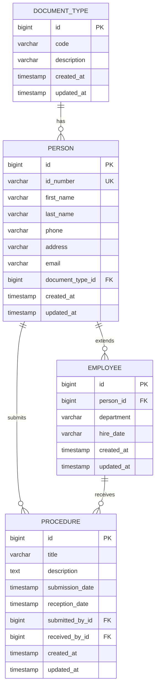

# 🏛️ Sistema de Gestión de Trámites - SIC

## 📋 Descripción General

El **Sistema de Gestión de Trámites SIC** es una aplicación web completa desarrollada para la gestión integral de trámites administrativos. El sistema permite la administración de personas, empleados, tipos de documentos y procedimientos(Tramites), con un enfoque moderno en arquitectura de microservicios y seguridad robusta.


### 📋 Flujo de Datos:
1. **Usuario** accede a la aplicación web
2. **Frontend Angular** (con PrimeNG) maneja la interfaz
3. **Nginx** actúa como proxy reverso
4. **Backend Spring Boot** procesa la lógica de negocio
5. **PostgreSQL** almacena los datos
6. **Keycloak** gestiona autenticación y autorización
7. **Vault** administra secretos y configuraciones

## 🛠️ Stack Tecnológico

### 🎯 Frontend
- **Framework:** Angular 17.3.0
- **UI Library:** PrimeNG 17.18.15 + PrimeFlex 3.3.1
- **Autenticación:** Keycloak Angular 15.3.0
- **Internacionalización:** @ngx-translate/core 16.0.4
- **HTTP Client:** Angular HttpClient
- **Estilos:** SCSS
- **Build Tool:** Angular CLI

### ⚙️ Backend
- **Framework:** Spring Boot 3.4.0
- **Java Version:** Java 21
- **Seguridad:** Spring Security 6.4.4 + OAuth2 Resource Server
- **Base de Datos:** PostgreSQL 16 con Spring Data JPA
- **Pool de Conexiones:** HikariCP 5.1.0
- **Validación:** Jakarta Validation API 3.0.2
- **Mapeo de Objetos:** Jackson + Lombok
- **Documentación API:** SpringDoc OpenAPI (Swagger)

### 🐳 Infraestructura y DevOps
- **Contenedorización:** Docker + Docker Compose
- **Base de Datos:** PostgreSQL 16
- **Gestión de Identidades:** Keycloak 25.0.6
- **Gestión de Secretos:** HashiCorp Vault 1.13
- **Reverse Proxy:** Nginx
- **Orquestación:** Docker Compose

## 📐 Arquitectura de Capas

### Backend (Spring Boot)
```
co.gov.sic.testsic/
├── controller/           # Capa de Controladores REST
├── service/             # Lógica de Negocio
├── infrastructura/
│   ├── entity/         # Entidades JPA
│   ├── repository/     # Repositorios Spring Data
│   └── dto/           # DTOs de Request/Response
└── config/            # Configuraciones
```

### Frontend (Angular)
```
src/app/
├── modules/            # Módulos de Funcionalidad
│   ├── persons/       # Gestión de Personas
│   ├── employees/     # Gestión de Empleados
│   ├── document-types/# Tipos de Documento
│   └── procedures/    # Gestión de Trámites
├── shared/            # Servicios y Componentes Compartidos
├── gui/layout/        # Layout y Navegación
├── common/            # Módulos Comunes (PrimeNG)
└── utils/             # Utilidades y Configuraciones
```

## 🎯 Funcionalidades Principales

### 👥 Gestión de Personas
- **CRUD Completo:** Crear, leer, actualizar y eliminar personas
- **Campos:** Número de documento, nombres, apellidos, teléfono, dirección, email
- **Validaciones:** Campos obligatorios y formatos de datos
- **Relaciones:** Asociación con tipos de documento

### 👔 Gestión de Empleados
- **CRUD Completo:** Gestión integral de empleados
- **Campos:** Departamento, fecha de contratación
- **Relaciones:** Hereda de la entidad Person
- **Funcionalidades:** Asignación de trámites como receptores

### 📄 Tipos de Documento
- **CRUD Completo:** Administración de tipos de documento
- **Campos:** Código y descripción
- **Propósito:** Clasificación de documentos de identidad

### 📋 Gestión de Trámites
- **CRUD Completo:** Control total de procedimientos
- **Campos:** Título, descripción, fechas de envío y recepción
- **Relaciones:** 
  - Solicitante (Person)
  - Receptor (Employee)
- **Estados:** Pendiente, en proceso, completado

## 🔐 Seguridad y Autenticación

### Keycloak Integration
- **Realm:** SicTest
- **Client ID:** SicTest
- **Protocolo:** OpenID Connect
- **Tipo de Cliente:** Público
- **Usuario por Defecto:** 
  - Username: `sic`
  - Password: `12345`

### Configuración de Seguridad
```yaml
# Configuración OAuth2
spring.security.oauth2.resourceserver.jwt.issuer-uri: 
  http://localhost:8080/realms/SicTest

# Configuración JWT
jwt.auth.converter.principalAttribute: preferred_username
jwt.auth.converter.resourceId: SicTest
```

## 🗄️ Modelo de Datos

### Diagrama Entidad-Relación


## 🚀 Instalación y Despliegue

### Prerrequisitos
- Docker y Docker Compose
- Git
- Puertos disponibles: 80, 5432, 8080, 8081, 8200

### Instalación Completa
```bash
# Clonar el repositorio
git clone <repository-url>
cd Sic

# Levantar toda la infraestructura
cd docker-compose
docker-compose up --build
```

### Servicios Desplegados
| Servicio | Puerto | Descripción |
|----------|--------|-------------|
| Frontend | 80 | Aplicación Angular |
| Backend | 8081 | API REST Spring Boot |
| PostgreSQL | 5432 | Base de datos |
| Keycloak | 8080 | Servidor de autenticación |
| Vault | 8200 | Gestión de secretos |

### Acceso a la Aplicación
- **Frontend:** http://localhost
- **Backend API:** http://localhost:8081/api/sic
- **Swagger UI:** http://localhost:8081/api/sic/swagger-ui.html
- **Keycloak Admin:** http://localhost:8080 (admin/admin123)
- **Vault UI:** http://localhost:8200 (token: root)

## 🔧 Configuración de Desarrollo

### Variables de Entorno
```bash
# Backend
VAULT_TOKEN=root
SPRING_PROFILES_ACTIVE=local

# Database
POSTGRES_DB=sic
POSTGRES_USER=sicdbadmin
POSTGRES_PASSWORD=123456

# Keycloak
KEYCLOAK_ADMIN=admin
KEYCLOAK_ADMIN_PASSWORD=admin123
```

### Comandos de Desarrollo
```bash
# Backend
cd SicBackend
./gradlew bootRun

# Frontend
cd web-sic
npm install
npm start
```

## 📡 API Endpoints

### Documentación Completa
La API REST está completamente documentada con OpenAPI/Swagger:
- **URL:** http://localhost:8081/api/sic/swagger-ui.html

### Endpoints Principales
```
GET    /api/sic/persons              # Listar personas
POST   /api/sic/persons              # Crear persona
GET    /api/sic/persons/{id}         # Obtener persona
PUT    /api/sic/persons/{id}         # Actualizar persona
DELETE /api/sic/persons/{id}         # Eliminar persona

GET    /api/sic/employees            # Listar empleados
POST   /api/sic/employees            # Crear empleado
GET    /api/sic/employees/{id}       # Obtener empleado
PUT    /api/sic/employees/{id}       # Actualizar empleado
DELETE /api/sic/employees/{id}       # Eliminar empleado

GET    /api/sic/document-types       # Listar tipos documento
POST   /api/sic/document-types       # Crear tipo documento
GET    /api/sic/document-types/{id}  # Obtener tipo documento
PUT    /api/sic/document-types/{id}  # Actualizar tipo documento
DELETE /api/sic/document-types/{id}  # Eliminar tipo documento

GET    /api/sic/procedures           # Listar procedimientos
POST   /api/sic/procedures           # Crear procedimiento
GET    /api/sic/procedures/{id}      # Obtener procedimiento
PUT    /api/sic/procedures/{id}      # Actualizar procedimiento
DELETE /api/sic/procedures/{id}      # Eliminar procedimiento
```

## 🎨 Interfaz de Usuario

### Componentes PrimeNG Utilizados
- **Tablas:** p-table con paginación y filtros
- **Formularios:** p-dialog para modales de creación/edición
- **Botones:** p-button con iconografía
- **Campos:** p-inputText, p-dropdown, p-calendar
- **Notificaciones:** p-toast para mensajes
- **Navegación:** p-menubar, p-breadcrumb

### Características de UX/UI
- ✅ Diseño responsivo
- ✅ Tema moderno con PrimeNG
- ✅ Internacionalización (ES/EN)
- ✅ Validaciones en tiempo real
- ✅ Confirmaciones de acciones destructivas
- ✅ Loading states y feedback visual

## 🏗️ Patrones y Buenas Prácticas

### Backend
- **Arquitectura en Capas:** Controller → Service → Repository
- **DTOs:** Separación entre entidades y DTOs de transferencia
- **Exception Handling:** Manejo centralizado de errores
- **Validation:** Validaciones con Jakarta Validation API
- **Security:** Protección OAuth2 en todos los endpoints
- **Clean Code:** Uso de Lombok para reducir boilerplate

### Frontend
- **Modular Architecture:** Separación por módulos funcionales
- **Reactive Programming:** Uso de Observables (RxJS)
- **Type Safety:** TypeScript en toda la aplicación
- **Component Reusability:** Componentes reutilizables
- **State Management:** Servicios para gestión de estado
- **Error Handling:** Interceptors para manejo de errores HTTP

## 🐳 Docker Configuration

### Servicios del Docker Compose
```yaml
services:
  postgres:      # Base de datos PostgreSQL 16
  keycloak:      # Servidor de autenticación
  vault:         # Gestión de secretos
  vault-init:    # Inicialización de secretos
  keycloak-init: # Configuración inicial de Keycloak
  backend:       # API Spring Boot
  frontend:      # Aplicación Angular + Nginx
```

### Volúmenes y Persistencia
- **vault-data:** Datos persistentes de Vault
- **postgres-data:** Base de datos PostgreSQL (implícito)

## 📊 Monitoreo y Observabilidad

### Logging
- **Backend:** Logback con configuración personalizada
- **Niveles:** DEBUG, INFO, WARN, ERROR
- **Formato:** JSON estructurado para análisis

### Health Checks
- **PostgreSQL:** Verificación de conectividad
- **Backend:** Spring Boot Actuator
- **Keycloak:** Health endpoint disponible

## 🔒 Gestión de Secretos

### HashiCorp Vault
- **Engine:** KV v2
- **Path:** `kv/applications/local/TestSic`
- **Secretos Almacenados:**
  - Configuración de base de datos
  - Configuración OAuth2
  - Configuración de pools de conexión

### Configuración Dinámica
```yaml
spring:
  config:
    import: vault://kv/applications/local/${spring.application.name}
  cloud:
    vault:
      token: ${VAULT_TOKEN}
      authentication: TOKEN
```

## 🧪 Testing

### Backend Testing
```bash
cd SicBackend
./gradlew test
```

### Frontend Testing
```bash
cd web-sic
npm test
```

## 📈 Escalabilidad y Performance

### Backend Optimizations
- **Connection Pooling:** HikariCP configurado
- **JPA Optimizations:** Lazy loading, fetch strategies
- **Caching:** Preparado para Redis (futuro)

### Frontend Optimizations
- **Lazy Loading:** Módulos cargados bajo demanda
- **OnPush Strategy:** Optimización de change detection
- **Bundle Optimization:** Webpack optimizations

## 🔮 Roadmap y Mejoras Futuras

### Funcionalidades Planeadas
- [ ] Módulo de reportes y dashboards
- [ ] Sistema de notificaciones en tiempo real
- [ ] API GraphQL
- [ ] Aplicación móvil (Ionic/React Native)
- [ ] Integración con servicios externos
- [ ] Sistema de workflows avanzado

### Mejoras Técnicas
- [ ] Migración a microservicios independientes
- [ ] Implementación de Event Sourcing
- [ ] Cache distribuido con Redis
- [ ] Monitoreo con Prometheus/Grafana
- [ ] CI/CD con Jenkins/GitHub Actions
- [ ] Tests de integración automatizados

## 👥 Equipo de Desarrollo

**Desarrollado por:** [Ernesto Luis Mosquera Heredia](https://github.com/emosquerafs)

**Repositorio Backend:** [github.com/emosquerafs/backendtest-sic](https://github.com/emosquerafs/backendtest-sic)

## 📝 Licencia

Este proyecto está bajo una licencia privada. Todos los derechos reservados.

---

## 🚀 Quick Start Guide

```bash
# 1. Clonar el repositorio
git clone <repository-url>
cd Sic

# 2. Levantar la infraestructura
cd docker-compose
docker-compose up --build

# 3. Acceder a la aplicación
# Frontend: http://localhost
# Login: sic / 12345

# 4. Explorar la API
# Swagger UI: http://localhost:8081/api/sic/swagger-ui.html
```

**¡El sistema estará listo para usar en pocos minutos!** 🎉
